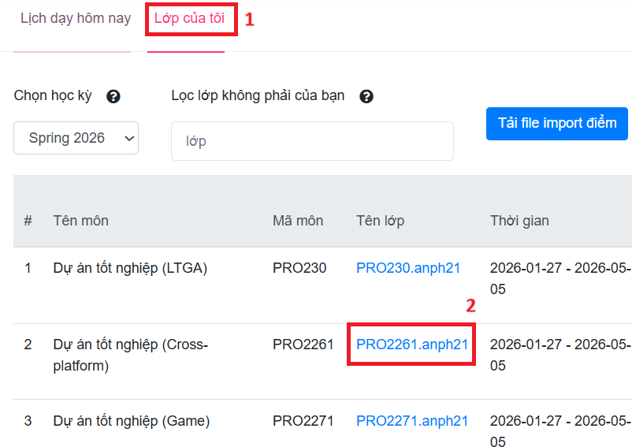
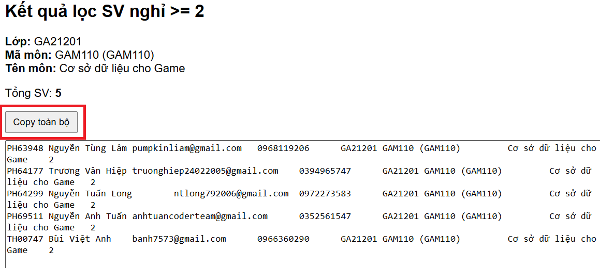

# Hướng dẫn lấy danh sách sinh viên

## Các bước thực hiện
- Đăng nhập vào trang AP bằng tải khoản giảng viên
- Mở lớp của tôi

- Chọn vào tên lớp để mở một lớp cụ thể cần lọc danh sách sinh viên nghỉ 2 buổi đầu
- Tại danh sách mở ra, bấm *F12* mở console
- Copy code tại file 
- Dán vào console và bấm *Enter*
- Kết quả sẽ hiện ra trong console

- Tại file google sheet chia sẻ bộ môn mỗi block, chọn ô trống đầu tiên cột B, và dán kết quả vào đó 
- Điền mã gv vào cột *H*

## Lưu ý
- Chỉ áp dụng cho các lớp có danh sách sinh viên được hiển thị trên trang AP